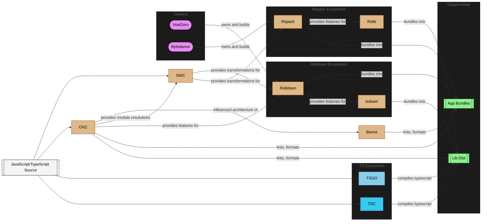

# compilers

## rustlang ecosystem

**How the tools/libs relate to each other.**

```mermaid
graph LR
    JS[[JavaScript/TypeScript Source]] --> SWC
    JS --> OXC
    JS --> TSGO
    JS --> TSC

    subgraph TSEcosystem[TS Ecosystem]
    TSC[TSC]
    TSGO[TSGO]
    end
    TSC -->|compiles typescript| LibOutput
    TSGO -->|compiles typescript| LibOutput

    subgraph RspackEcosystem[Rspack Ecosystem]
    Rspack -->|provides features for| Rslib[Rslib]
    end
    Rspack[Rspack] -->|bundles into| AppOutput
    Rslib -->|bundles into| LibOutput

    subgraph RolldownEcosystem[Rolldown Ecosystem]
    Rolldown[Rolldown]
    Tsdown[tsdown]
    end
    Rolldown -->|bundles into| AppOutput
    Tsdown -->|bundles into| LibOutput
    Rolldown -->|provides features for| Tsdown

    SWC[SWC] -->|provides transformations for| Rolldown
    SWC -->|provides transformations for| Rspack

    OXC[OXC] -->|influenced architecture of| Biome
    OXC -->|provides module resulutions| SWC
    OXC -->|provides features for| Rolldown

    subgraph OutputKinds[Output Kinds]
    AppOutput[[App Bundles]]
    LibOutput[[Lib Dist]]
    end

    Biome[Biome] -->|lints, formats| AppOutput
    OXC -->|lints, formats| AppOutput
    OXC -->|lints, formats| LibOutput

    subgraph Owners[Owners]
    VoidZero([VoidZero])
    Bytedance([Bytedance])
    end
    VoidZero -->|owns and builds| Rolldown
    Bytedance -->|owns and builds| Rspack

    classDef rust fill:#deb887,stroke:#8b4513,color:#000
    classDef go fill:#87ceeb,stroke:#4682b4,color:#000
    classDef ts fill:#37caee,stroke:#4682b4,color:#000
    classDef input fill:#f5f5f5,stroke:#333,color:#000
    classDef output fill:#90ee90,stroke:#006400,color:#000
    classDef org fill:#e690ee,stroke:#570064,color:#000
    classDef group fill:#1b1b1b,stroke:#1b1b1b,color:#696969

    class SWC,OXC,Rolldown,Tsdown,Rspack,Rslib,Biome rust
    class TSGO go
    class TSC ts
    class JS input
    class AppOutput,LibOutput output
    class VoidZero,Bytedance org
    class Owners,RolldownEcosystem,RspackEcosystem,TSEcosystem,OutputKinds group
```
