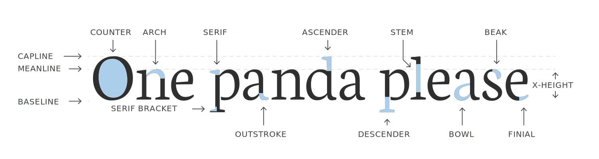
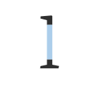

# anatomy of english typography

| Appearance | Term | Description |
| --- | --- | --- |
|  | **COUNTER** | _Enclosed spaces._ |
|  | **ARCH** | _Upper curves._ |
|  | **SERIF** | _From the process of carving letters into stone. The serif marks the first strike into the stone._ |
|  | **SERIF BRAKCET** | _The style of the serif connected to the stem._ |
|  | **OUTSTROKE** | _A stylized serif, used to end the last stroke of a letter._ |
|  | **ASCENDER** | _The part of a stem that rises above the meanline._ |
|  | **STEM** | _Any vertical stroke._ |
|  | **DESCENDER** | _The part that hangs below the baseline._ |
|  | **BOWL** | _Any rounded part that contains a counter space._ |
|  | **BEAK** | _The extension of the serif, usually located at the top of letters._ |
|  | **FINIAL** | _An unstylized way of ending the last stroke._ |

## credit

_Sourced from the brilliant "[Types of Types](https://typesoftype.com/about)" by [Amanda Lui](https://amandalui.com/), which explores the typographical similarities between English and Korean. Even if you can't read _